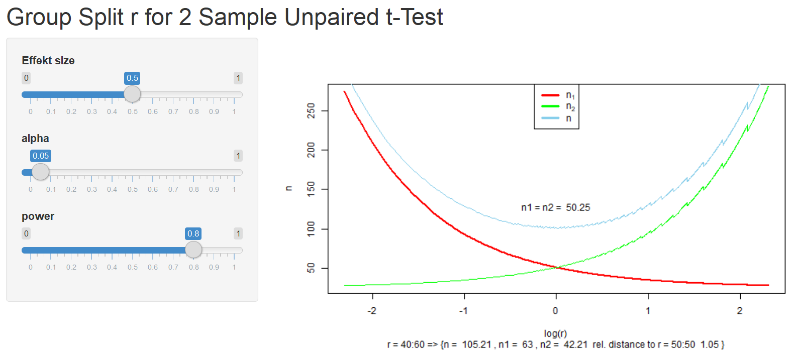

# FallzahlPlanung  

## Overview
***

This code is for the detection of the split rate $r$ for the distribution of the overall sample size$n$ on the groups $n_1$ and $n_2$ (or $n = n_1 \times r$ ) given:  

  - min effect size which matters    
  - significance level $\alpha$  
  - Power 

## Terminal and Output

